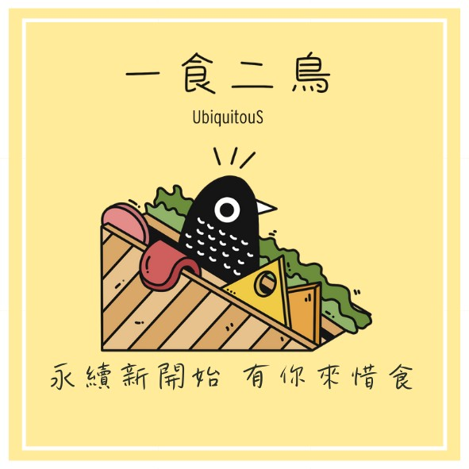

# Feather Feast

[](https://github.com/1chooo/line-leftovers-bot)
[](https://python.org "Go to Python homepage")
[](./LICENSE "Go to license section")

## A brief summary of the project

The primary objective of this project is to develop a Line Bot with an ordering system to address the issue of food waste. 
Our approach involves integrating the concept of "SDGs" (Sustainable Development Goals) and promoting the idea of "preserving the environment for the long term."

| [一食二鳥——剩食媒合平台](https://lin.ee/Iohs4wU) | LINE QRCODE |
|:-:|:-:|
| |  |

### Project Structure
```
PROJECT_ROOT
├── assets                    # Docs, imgs
├── LeftoversPackage          # Project Package
│   ├── DatabaseService.py    # database function
│   ├── Tools.py              # Project tools
│   └── Generator.py          # Generator LINE BOT Drama
├── log                       # User's log
├── templates                 # flask templates
└── venv                      # pip vertial env
```

### Enviroment: 

#### With pip vertial environment
python request: `3.10.1`

```
$ pip3 install virtualenv
$ virtualenv venv --python=python3.10
$ source venv/bin/activate
$ pip install --upgrade pip
$ pip install -r requirements.txt
$ deactivate
$ rm -rf venv     # remove the venv
```

#### Config Example
```py
# line bot info
line_bot_api = ''
handler = ''

# database settings
database_host=''
database_port=''
database_user=''
database_passwd=''
database_db=''
database_charset=''

# Domain Settings
SERVER_DOMAIN_URL = ''

# image server host
image_server_host=''
image_folder=''

```


#### With ngrok free server
```SHELL
brew install ngrok --cask
ngrok config add-authtoken TOKEN
python run.py
ngrok http 5002
```

#### Start multiple tunnel
* with `ngrok config check` to find `ngrok.yml`.
* Add the below code in `ngrok.yml`
```yml
version: "2"
authtoken: "token"
### 上方不需更動
tunnels:
  first:
    addr: 5002
    proto: http    
  second:
    addr: 5012
    proto: http
```
* type `ngrok start --all` to start ngrok
* type `image server url` into `config.image_server_host`
* set the saving path of `image` into `config.image_folder`


### [Reference](./assets/reference.md)

### License
Released under [MIT](./LICENSE) by @1chooo.

This software can be modified and reused without restriction.
The original license must be included with any copies of this software.
If a significant portion of the source code is used, please provide a link back to this repository.
